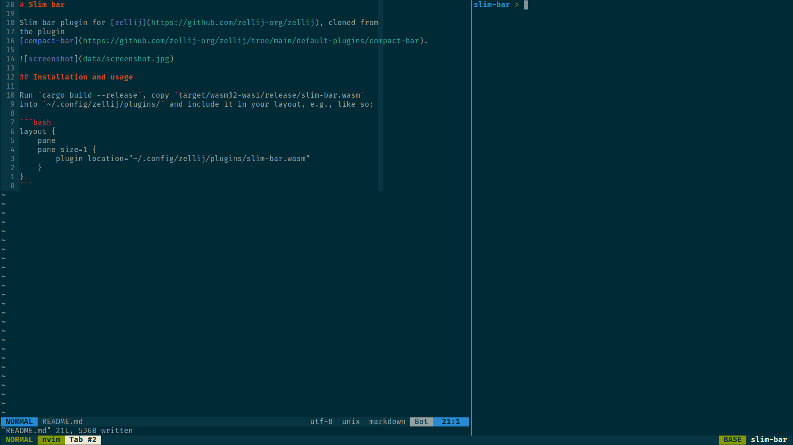

# Slim bar

Slim bar plugin for [zellij](https://github.com/zellij-org/zellij), cloned from
the plugin
[compact-bar](https://github.com/zellij-org/zellij/tree/main/default-plugins/compact-bar).



## Installation and usage

Run `cargo build --release`, copy `target/wasm32-wasi/release/slim-bar.wasm`
into `~/.config/zellij/plugins/` and include it in your layout, e.g., like so:

```bash
layout {
    pane
    pane size=1 {
        plugin location="~/.config/zellij/plugins/slim-bar.wasm"
    }
}
```
